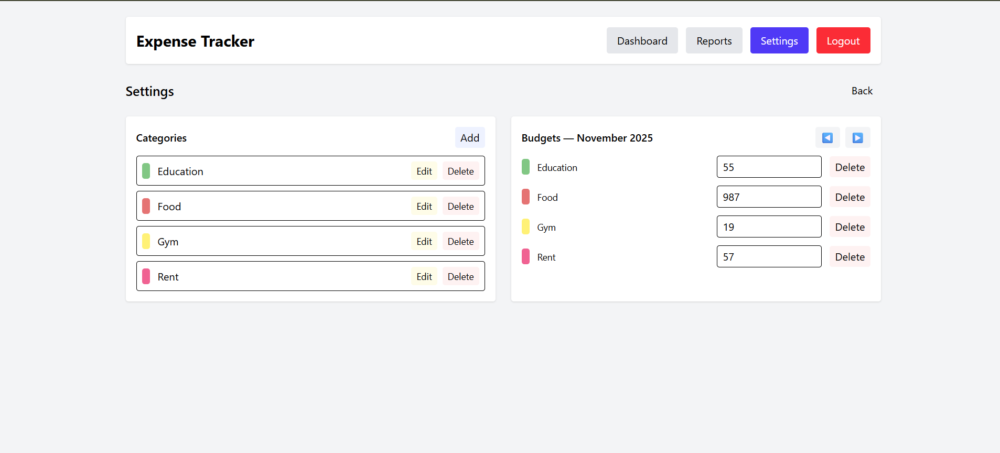
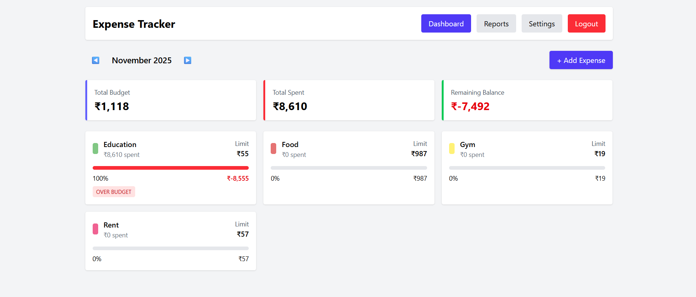
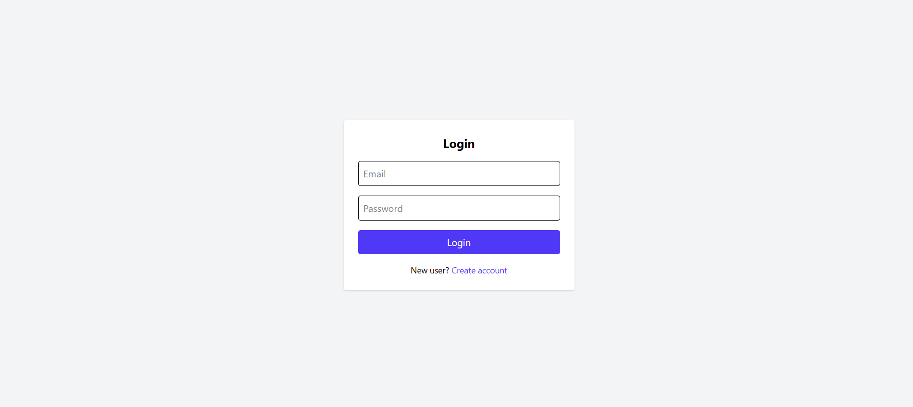

# 🎨 Budget Tracker Frontend — React + Vite + Tailwind

This is the **frontend** of the **Budget Tracker Application**, built using **React + Vite**, **Tailwind CSS**, **Axios**, and **React Router**.  
It connects to your Node.js backend to manage budgets, expenses, categories, and monthly reports.

---

## 🌐 Live Demo

🚀 **Frontend Live URL:**  
https://budget-tracker-frontend-peach.vercel.app/

📦 **Backend API:**  
https://budget-tracker-backend-7vqz.onrender.com

📁 **GitHub Repository:**  
https://github.com/ajps208/Budget_Tracker_Frontend

---

## ✨ Features

✔️ User Authentication (Signup & Login)  
✔️ Dashboard with Month Navigation  
✔️ Add / Edit / Delete Expenses  
✔️ Category Management  
✔️ Monthly Budget Planning  
✔️ Budget Reports  
✔️ Fully Responsive (Mobile + Desktop)  
✔️ Modern UI using TailwindCSS  
✔️ Vite-powered fast development  

---

## 🧱 Tech Stack

### **Frontend**
- React.js (Vite)
- Tailwind CSS
- Axios
- React Router DOM
- Utilities

### **Backend (Connected API)**
- Node.js + Express.js  
- MongoDB + Mongoose  
- JWT Auth  

---

## 📁 Folder Structure

```
frontend/
├─ public/
├─ src/
│  ├─ components/
│  │   ├─ Dashboard.jsx
│  │   ├─ Reports.jsx
│  │   ├─ Settings.jsx
│  │   ├─ ExpenseForm.jsx
│  │   └─ ProtectedRoute.jsx
│  │
│  ├─ pages/
│  │   ├─ Login.jsx
│  │   └─ Signup.jsx
│  │
│  ├─ services/
│  │   └─ api.js
│  │
│  ├─ utils/
│  │   └─ helpers.js
│  │
│  ├─ App.jsx
│  └─ main.jsx
│
├─ .env
├─ package.json
└─ README.md
```

---

## ⚙️ Installation & Setup

### 1️⃣ Clone the repository
```bash
git clone https://github.com/ajps208/Budget_Tracker_Frontend
cd Budget_Tracker_Frontend
```

### 2️⃣ Install dependencies
```bash
npm install
```

### 3️⃣ Create `.env` file
```
VITE_API_URL=https://budget-tracker-backend-7vqz.onrender.com/api
```

### 4️⃣ Start development server
```bash
npm run dev
```

---

## 🔗 API Integration (Axios Setup)

`src/services/api.js`
```js
import axios from "axios";

const API = axios.create({
  baseURL: import.meta.env.VITE_API_URL,
});

// attach token
API.interceptors.request.use((config) => {
  const token = localStorage.getItem("token");
  if (token) config.headers.Authorization = `Bearer ${token}`;
  return config;
});

export default API;
```

---

## 🔐 Protected Routes

Authentication is handled using:

- JWT stored in localStorage  
- Axios interceptor  
- `<ProtectedRoute/>` wrapper  

---

## 🧪 Testing the App

You can test the live app here:

🔗 **https://budget-tracker-frontend-peach.vercel.app/**

Or run locally using credentials you created via backend signup.

---

## 🚀 Deployment

The frontend is deployed on **Vercel**.

### Build command
```bash
npm run build
```

### Output directory
```
dist/
```

---

## 📸 Screenshots





---


## 🙌 Author

**Ajith P S**  
Full Stack Developer  
Tech Stack: React · Node.js · Express · MongoDB  
